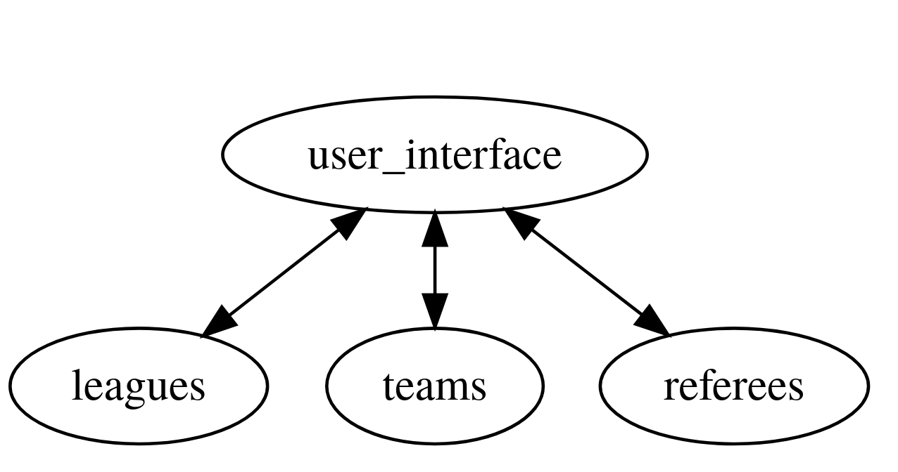

# Distributed Systems Football League Manual
This manual has the following parts:
- Setup
  - requirements
  - installation
- Design choices
  - Architecture
    - Teams
    - Leagues
    - Referees
    - User Interface
  - Extra tools
- Using the site
  - League tables, fixtures, statistics
  - Specific fixtures
  - Team pages
  - Accounts and login
    - Team accounts
    - Admin
    - Superadmin
  - Admin interface
    - Performing CRUD operations
    - Assigning referees
    - Removing/granting admin permissions
  - Team portal
  
## Setup
### Requirements
- Docker
- docker-compose
- Python 3

### Installing and running
Run `install.sh`, this should do everything. You should now be able to acces the site at `http://localhost:5001/`.

## Design choices
### Architecture
I chose to decompose the entire site into the four following services:

- teams
- leagues
- referees
- user-interface

I thought it would be best to have one service, `user-interface` do all the rendering, and then split the rest up in three 'data' containers who provide an API to access, perform operations on and update their data. Thus, `user-interface` exclusively does rendering, while the `leagues`, `teams` and `referee` services do the computing and data processing. The `leagues` service provides an API to interact with the data on matches, divisions and statusses of matches, the `teams` service does this for information on clubs and teams, and the `referees` service for data on referees.

Furthermore, I chose to group things that are closely related. For example the data on status and the data on matches are available through the same service, because we only need status data when we are talking about matches, hence making seperate services for them would result in a bunch of extra unnecessary calls without extra functionality. 

### Teams
This service provides data related to teams and clubs. It is accessible through port `5003` and has the following endpoints:

- `[GET] /teams/<team_id>`
  - gives information on a single team in JSON
- `[GET] /teams/<team_id>/address`
  - gives the city, address and zip code of a single team in JSON
- `[GET] /teams/<team_id>/club`
  - gives information about the club the team belongs to in JSON
- `[GET] /teams/<team_id>/full-name`
  - gives the full name of the team (the club name + suffix) 
- `[GET] /teams/full-names`
  - gives a JSON with the full names of all teams of the form `<team_id, full_name>`
- `[GET] /teams`
  - gives all information on all teams in JSON
- `[GET] /clubs/<stam_id>`
  - returns all information from a single club in JSON
- `[PUT] /teams/<team_id>/club`
  - replaces the info of a club of a team with the given info
- `[PUT] /teams/<team_id>`
  - replaces the info of a team with the given info

### Leagues
This service provides data related to matches, divisions and the status of a match. It runs on port `5005` and has the following endpoints
- `[GET] /divisions/<division_id>`
  - returns a JSON containing the info on a division
- `[GET] /divisions/`
  - returns a JSON containing the info all divisions
- `[GET] /matches/<match_id>`
  - returns a JSON containing the info on a match
- `[GET] /matches/team/<team_id>`
  - returns a JSON containing matches from a team
- `[GET] /matches/home-team/<team_id>`
  - returns a JSON containing matches from a team, where the team was playing as the home team
- `[GET] /matches/home-team/<team_id>/recent`
  - returns a JSON containing the three most recently played matches from a team
- `[GET] /matches/home-team/<team_id>/upcoming`
  - returns a JSON containing upcoming matches for a team
- `[GET] /matches/division/<division_id>/matchweek/<matchweek_nr>`
  - returns a JSON containing all matches in a division for a matchweek
- `[GET] /matches/per-week`
  - returns a JSON containing all matches, grouped together per matchweek
- `[GET] /matches/division/<division_id>/per-week`
  - returns a JSON containing all matches within a division, grouped together per matchweek
- `[GET] /matches/matchweek/<matchweek_nr>/referees/assigned`
  - returns a JSON containing the ID's of referees who are assigned to a match in a matchweek
- `[GET] /matches/division/<division_id>/best-attack`
  -  returns a JSON containing the team which currently has the most goals in a division
- `[GET] /matches/division/<division_id>/best-defense`
  -  returns a JSON containing the team which currently has the least goals conceded in a division
- `[GET] /matches/division/<division_id>/most-clean-sheets`
  -  returns a JSON containing the team which currently has the most clean sheets in a division
- `[GET] /matches/division/<division_id>/team-points`
  -  returns a JSON containing the point total for each team in a division
- `[GET] /matches/track-record/<team_id>`
  - returns a String with the track record of a team for the last 5 matches, for example "WWLGW""
- `[GET] /matches/statistics/<team_1_id>/vs/<team_2_id>`
  - returns a JSON containing the amount of times team_1 played, wun and scored equal against team 2
- `[GET] /matches/<team_1_id>/vs/<team_2_id>`
  - returns a JSON containing the matches where team 1 played against team 2 and reverse
- `[GET] /matches/division/<division_id>/statistics`
  - returns a JSON containing statistics about the division 
- `[GET] /status/full-names`
  - returns a JSON containing the full names of the different statusses a match can have
- `[PUT] /matches/<match_id>/score'`
  - replaces the score of a match with the given data
- `[POST] /matches/<match_id>/referee`
  - changes the referee of a match
 
### Referees
This service provides data related on referees. It is accessible through port `5006` and has the following endpoints:
- `[GET] /referees/`
  - returns a JSON containing all info on all referees
- `[GET] /referees/names`
  - returns a JSON containing the full names of all the referees, in the form <referee_id, name>
- `[GET] /referees/<referee_id>`
  - returns a JSON containing info on a referee

### User Interface
This service acts as the frontend of the site. It is accessible through port `5001` and has the following endpoints:
- `[GET, POST] /divisions/<division_id>`
- `[GET] /divisions`
- `[GET] /matches/<match_id>`
- `[GET] /teams`
- `[GET] /teams/<team_id>`
- `[GET] /user/team-portal`
- `[GET, POST] /user/match/<match_id>/edit`
- `[GET, POST] /user/club/edit`
- `[GET, POST] /user/team/edit`
- `[GET, POST] /user/match/<match_id>/referee`
- `[GET] /user/admin`
- `[GET, POST] /user/super-admin/permissions`
- `[GET] /admin/referee`
- `[GET] /admin/division`
- `[GET] /admin/team`
- `[GET] /admin/club`
- `[GET] /admin/user`
- `[GET] /admin/match`
- `[GET] /user/admin/referees/assign`
- `[GET] /login`
- `[GET] /logout`

### Extra tools
- Flask
- Flask-SQLAlchemy
- flask-login
- flask-wtf
- flask-admin
- psycopg2
- SQLAlchemy
- SQLAlchemy-serializer
- requests
- openweathermap
- Docker
- Docker-compose

## Using the site
In this section I will list all the required features, explaining how to access them, and how I handled them.

### League tables, fixtures, statistics
All of those can be found on the division-specific page by navigating to `Divisies`, and then choosing a division. This page gives us at the top under `Rangschikking` a small table with the best offense, best defense and most clean sheets for the division, followed by the league table.

The league table gives us for each team (in order)

- The rank, based on points
- The (full) team name
- Amount of games played already
- Amount of wins
- Amount of losses
- Amount of equal games
- Amount of goals made
- Amount of goals against the team
- The point total

Below the league table under `Wedstrijden`, we can see a bunch of smaller tables, one for each matchweek containing all matches for that division in that matchweek. In the `Speeldag 1` table for example are all matches from that division for the first matchweek. It is also possible to filter by team name and/or matchweek in the `Filter op team...` and `Filter op speeldag...` input fields respectively. Both fields support autocomplete.

### Specific fixtures
Each match has its own specific page containing all info known about the match. The date, kick-off time and referee assigned. Furthermore on the right, a table containing historical statistics from this match up is included, showing how many times the teams have faced each other, how many times team A has wun against team B and so on. and a weather prediction. Below these tables is a weather table giving the forecast for the next week. Finally, depending on if the match has already been played yet, either the score or the scores of the three most recent games they played against each other will show up below the match information.

These pages can be accessed in multiple ways, the easiest being to go to a division specific page and then for a match click the `Details wedstrijd` link. 

### Team pages
Each team has its own specific page as well, which can be found by clicking the `Ploegen` button in the navbar, and then for a team clicking the `Pagina van {team_name}` link in the table. This page contains info about the team, such as the colors, the stam club and suffix (`Geen` means None in English). Furthermore it shows the three most recent matches the team played, and all upcoming games for that team.

### Accounts and login
There is a login page behind the `Login` button in the navbar. Once logged in, you can logout with the `Logout` button in the navbar. There are three levels of acces:

#### Team accounts
Team accounts have acces to a portal where they can edit info regarding their team, more on this portal later. I have provided an account for every team. 
``
For example, for the team `Forza Mikaza Veteranen` we have 

    username: ForzaMikazaVeteranen (so just remove spaces from the team name, which is the club + the suffix)
    password: password (the same for every account)

#### Admin 
Admins can perform CRUD operations on the database entities. There is not a special account for this since every account can be promoted to admin by the superadmin.

#### Superadmin
Superadmins can grant or remove admin permissions, there is one superadmin account with the following login

    username: superadmin
    password: superadmin

### Admin interface
As an admin, an extra button will appear in the navigation bar, called `Admin`. This will bring up a small interface with the different things you can do:
- Perform CRUD on matches
- Perform CRUD on divisions
- Perform CRUD on teams
- Perform CRUD on clubs
- Perform CRUD on referees
- Perform CRUD on users
- Assign referees to matches

#### Performing CRUD
Choosing one of the green `Edit` buttons will redirect you to a page where you can perform crud operations on the selected entity. The user-interface for these page was generated using the `flask-admin` package. 

#### Assigning referees
Through the admin interface with the `Assign referees to matches`, you can assign/change/remove referees from matches. All matches are displayed per matchweek again, with the option to filter in the `Filter by matchweek...` input field.

You can then change or assign a referee to a match by clicking the `Assign` or `Change` link. This will bring you to a page showing 
- the currently assigned referee, with the option to remove the referee from the match (if a referee is assigned)
- the currently unavailable referees for that matchweek (the referees who are already assigned to another match)
- the currently available referees for that matchweek, with the option to assign them

#### Changing admin permissions
As a superadmin, an extra button `Add or remove admins` will appear on the admin interface. This brings up a table with all current users, and a green button to grant admin permissions, or a red button to remove admin permissions for each user, depending on if they already have them.

### Team portals
When logged in with an account linked to a team, a new button `Team portaal` will appear in the navbar. This brings you the team portal page. Here you can view and edit info on your team, club and the scores of all home-games of your team.
